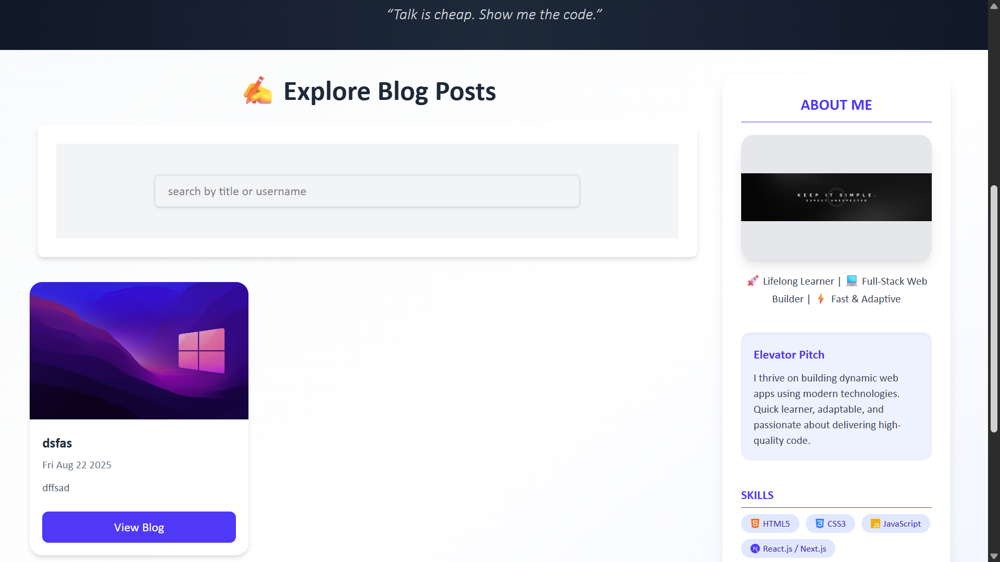
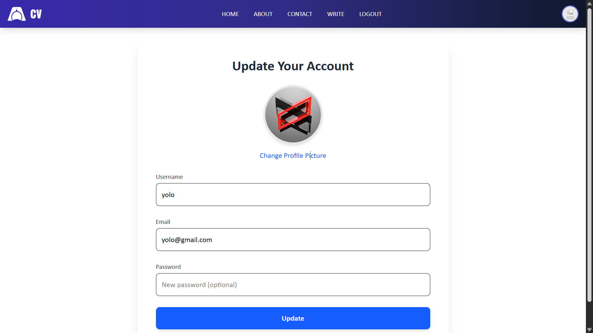

# 📝 QuirkLog

QuirkLog is a modern **MERN-stack blogging platform** where users can share, explore, and engage with blogs through a simple yet professional interface.  
Built with **React, Node.js, Express, and MongoDB**, QuirkLog emphasizes **speed, clean UI, and smooth user experience**.

---

## ✨ Features

- 🔍 **Smart Search** – Quickly find blogs by title with instant filtering and an intuitive loading state.  
- 📑 **Responsive Pagination** – Smoothly browse through posts with frontend-managed pagination.  
- 🎨 **Modern UI/UX** – Crafted using **TailwindCSS, Framer Motion**, and **lucide-react icons** for a clean and interactive design.  
- 📷 **Dynamic Post Images** – Integrated with Cloudinary for image hosting with fallback support.  
- ✍️ **Full CRUD** – Create, read, update, and delete blog posts seamlessly.  
- 🔒 **Authentication & Authorization** – Secure user accounts with login and registration features.  
- 🌐 **Responsive Design** – Works flawlessly across desktop, tablet, and mobile devices.  

---

## 🖼️ Screenshots

### 🔹 Pages
<p align="center">
  
  
</p>

<p align="center">
  
  
</p>


---

## 🛠️ Tech Stack

### Frontend
- ⚛️ React.js (bundled with Vite)  
- 🎨 TailwindCSS  
- 🎬 Framer Motion (animations)  
- 🖼️ lucide-react (icons)  

### Backend
- 🟢 Node.js  
- 🚀 Express.js  
- 🍃 MongoDB with Mongoose  
- ☁️ Cloudinary (Image hosting and management)  

---

## 📂 Project Structure

| Path                   | Description                                              |
|------------------------|----------------------------------------------------------|
| **quirklog/**          | Root directory                                           |
| ├── **backend/**       | Express.js + MongoDB REST API                            |
| │   ├── **controllers/**| Business logic (handle requests and responses)          |
| │   ├── **models/**    | Mongoose schemas defining database structure            |
| │   ├── **routes/**    | API route definitions                                    |
| │   ├── **middleware/**| Custom middleware (auth, upload, error handling)         |
| │   ├── **config/**    | Configuration files (database, Cloudinary)               |
| │   └── **server.js**  | Backend application entry point                           |
| ├── **frontend/**      | React (Vite + Tailwind) frontend                          |
| │   ├── **src/**       | Frontend source code                                      |
| │   │   ├── **components/**| Reusable UI components (Posts, Sidebar, etc.)         |
| │   │   ├── **pages/** | Page components (Home, Single Post, Write, About, Contact) |
| │   │   └── **App.jsx**| Main React application component                          |
| │   └── **index.html** | Frontend entry HTML file                                  |
| └── **README.md**      | Project documentation (this file)                        |

---

## 🚀 Getting Started

### Prerequisites

- [Node.js](https://nodejs.org/) (v14+ recommended)  
- [MongoDB](https://www.mongodb.com/) (local or cloud hosted)  
- [Cloudinary](https://cloudinary.com/) account for image storage  
- Git  

### 1️⃣ Clone the repository
```bash
git clone https://github.com/Developer200010/QuirkLog.git
cd QuirkLog
```

### 2️⃣ Install dependencies
```bash
cd frontend
npm install
# and for backend
npm install
```

### 3️⃣ Setup Environment Variables

### Create a `.env` file in the `backend` directory with the following variables:
### MONGO_URI=your_mongodb_connection_string
### JWT_SECRET=your_secret_key
### CLOUDINARY_CLOUD_NAME=xxxx
### CLOUDINARY_API_KEY=xxxx
### CLOUDINARY_API_SECRET=xxxx

